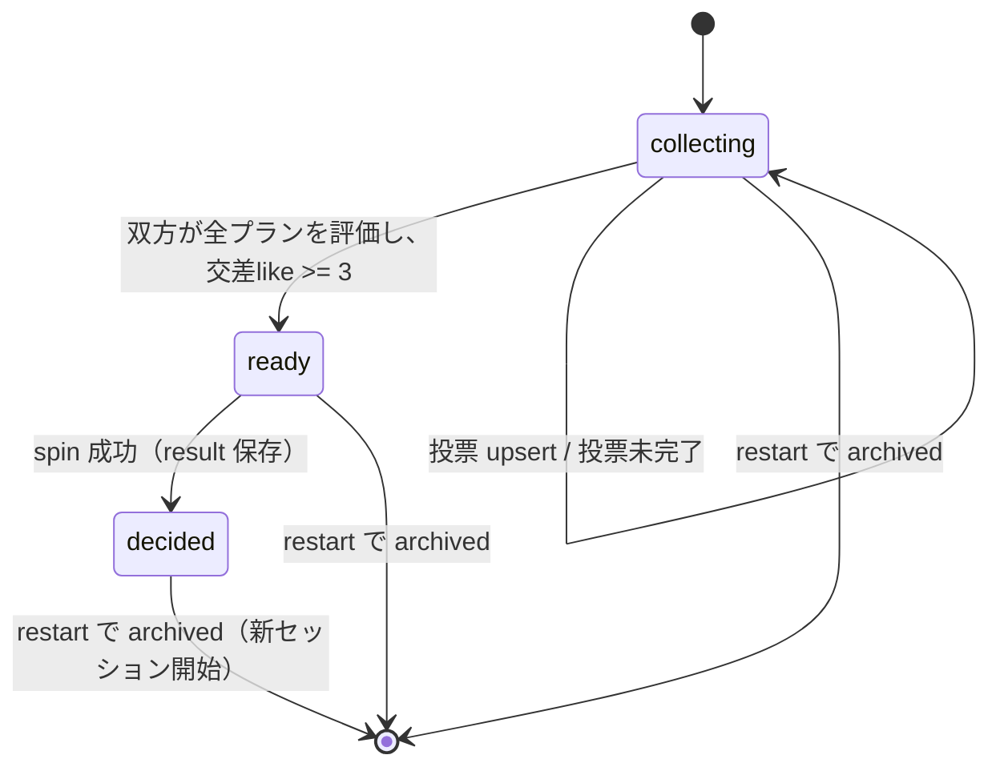

# P1-2 / P1-3 デートルーレット API 仕様

最終更新: 2026-05-02

## 目的

`P1-2`（プラン参照・本人投票・マッチ候補計算）と `P1-3`（抽選・結果保存）の API 契約と完了条件をまとめる。実装は ADR 0011 と OpenAPI を正本とし、本ドキュメントは運用・受け入れの索引にする。

## 参照

- OpenAPI: [../apps/api/openapi.yaml](../apps/api/openapi.yaml)
- ADR: [0011-date-roulette-state.md](./adr/0011-date-roulette-state.md)
- データモデル: [データモデル設計メモ.md](./データモデル設計メモ.md)
- マイグレーション: [../apps/api/migrations/0003_roulette.sql](../apps/api/migrations/0003_roulette.sql)
- 静的プランカタログ: [../apps/api/src/data/plans.ts](../apps/api/src/data/plans.ts)
- 品質ゲート: `npm run ci:pr`（lint + typecheck + `web:build` + `api:smoke`）

## 対象エンドポイント

| メソッド | パス | 概要 |
|----------|------|------|
| GET | `/roulette/plans` | 静的プランカタログを返す（ログイン必須） |
| GET | `/roulette/sessions/me` | 自カップルの active セッションを取得（無ければ collecting で新規作成） |
| POST | `/roulette/sessions/me/votes` | 自分の `like` / `pass` を一括 upsert |
| POST | `/roulette/sessions/me/spin` | `ready` のみ抽選を確定。`decided` は冪等で同じ結果を返す |
| POST | `/roulette/sessions/me/restart` | 現セッションをアーカイブし、新規 `collecting` を作成 |

## 状態遷移

## エラーコード一覧

| HTTP | code | 発生箇所 | 説明 |
|------|------|----------|------|
| 400 | `bad_request` | submitVotes | `votes` が配列でない / 必須フィールド欠落 / `vote` が `like` または `pass` 以外 |
| 400 | `unknown_plan` | submitVotes | `planId` が静的カタログに存在しない |
| 401 | `unauthorized` | 全ルート | Bearer token 不正 |
| 409 | `session_decided` | submitVotes | 既に `decided` のセッションへ投票しようとした |
| 409 | `session_not_ready` | spin | `ready` でないセッションへ抽選を要求した |
| 412 | `couple_required` | 全 `/roulette/sessions/me*` | カップルが `active` でない |

## 受け入れ基準（自動チェック）

`scripts/api-smoke-test.mjs` で次を確認している。

1. 2 ユーザー（A, B）登録 → 招待 → カップル `active`。
2. `GET /roulette/plans` で 3 件以上のカタログを取得。
3. A → B の順で全プランへ `like`。A 投票直後は `collecting` のまま、B 投票後は `ready`、`matchedPlanIds.length >= 3`。
4. A が `spin` → `decided` & `result.selectedPlanId` が `matchedPlanIds` に含まれる。
5. もう一度 `spin` → 同じ `selectedPlanId`（冪等）。
6. `restart` で新規 `collecting` セッションが作られ、`sessionId` が変わる。
7. 不正 `planId` の投票は `400 unknown_plan`。

## ローカルでの動かし方

- **Worker + ローカル D1** を使う場合: 先に **`npm run d1:migrate:local`** を実行する（`roulette_*` テーブル未作成のままだと `GET /roulette/sessions/me` が **500** になる）。
- `npm run api:dev`（Node + インメモリ・マイグレーション不要）または `npm run api:dev:worker`（D1 + Worker）。
- Staging/本番 D1: `npm run d1:migrate:staging` / `npm run d1:migrate:production`（`0003_roulette.sql` を含む）。
- フロント: `npm run web:dev`。ログイン後ホームの「デートルーレットを始める」から起動。

## MVP 外（ADR 0011 §決定 §MVP 外）

- 写真証拠 / 地域・予算・カテゴリフィルタ / カスタムプラン / SNS 自動投稿 / OGP 画像 / PWA Push / 履歴 UI / リアルタイム同期。
