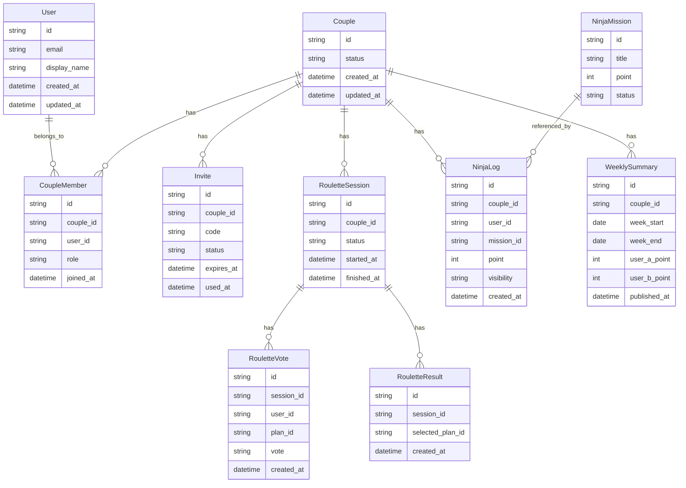

# データモデル設計メモ（P0-5 / 継続更新）

最終更新: 2026-05-02

## 目的

MVPで必要なコアエンティティ（`User` / `Couple` / `Invite` を中心）を定義し、Phase 1実装の共通前提を作る。

## スコープ

- 1stリリースMVPの必須フローに必要なデータのみ
- **永続層**は [ADR 0005](./adr/0005-database-d1.md) に従い **Cloudflare D1**（初版: [`../apps/api/migrations/0001_initial.sql`](../apps/api/migrations/0001_initial.sql)）。概念ERで示す `CoupleMember`・セッション・OTP・`auth_audit` 等の物理テーブルは同マイグレーションに含む
- 企画書にある拡張機能（写真証拠、高度な履歴等）は最小化

## ER（概念）

## エンティティ補足

- `Couple.status`: `pending` / `active` / `unpaired`
- `Invite.status`: `issued` / `used` / `expired` / `revoked`
- `RouletteSession.status`: `collecting` / `ready` / `decided`（[0011](./adr/0011-date-roulette-state.md)）
- `RouletteVote.vote`: `like` / `pass`
- `NinjaLog.visibility`: MVPでは `private_until_weekly_release` 固定

## ルーレット系の物理テーブル（[`apps/api/migrations/0003_roulette.sql`](../apps/api/migrations/0003_roulette.sql)）

- `roulette_sessions(id, couple_id, status, started_at, finished_at, archived_at)`。`archived_at IS NULL` を「カップルあたり active」と扱い、`couple_id` の部分インデックスで参照する。
- `roulette_votes(id, session_id, user_id, plan_id, vote, created_at)`、`UNIQUE(session_id, user_id, plan_id)`。再投票は upsert で上書きする。
- `roulette_results(id, session_id UNIQUE, selected_plan_id, created_at)`。1セッション1件。
- プランカタログは D1 に置かず、API バンドルの静的 TS 定数 [`apps/api/src/data/plans.ts`](../apps/api/src/data/plans.ts) を正本にする。`plan_id` の整合性はアプリ層で検証（[0011](./adr/0011-date-roulette-state.md)）。

## MVPで守る制約

- 1ユーザーが同時に所属できる `active` な `Couple` は1件
- `Invite.code` は有効期間内で一意
- `RouletteResult` は1セッションにつき1件
- ルーレット投票は `(session_id, user_id, plan_id)` で UNIQUE（再投票は上書き）
- ルーレットセッションは `decided` に到達したら**結果不変**。再挑戦は新セッションを開始する（旧セッションは `archived_at` で切り離す）
- collecting 中のレスポンスに**相手の vote 内容**を含めない（"完了したか"のみ返す）
- 週次公開前の `NinjaLog` は相手へ非表示

## 次アクション

- ニンジャ用の物理テーブルは、ADR4（ニンジャ申告）・ADR5（週次集計）の作成後に `migrations/` を拡張する
- API境界に合わせて入出力DTOを定義（Phase 1）
- 現状のドメイン型は [apps/api/src/domain/types.ts](../apps/api/src/domain/types.ts) を参照
