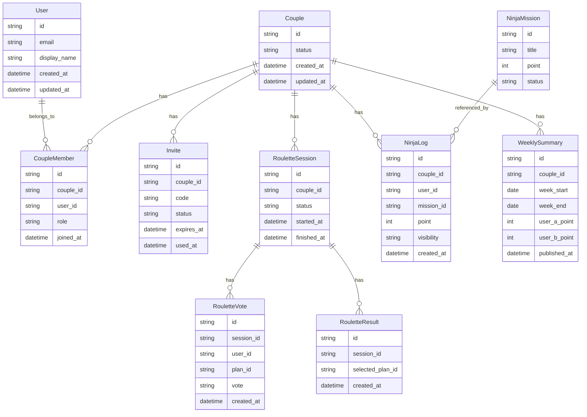

# データモデル設計メモ（P0-5）

最終更新: 2026-04-25

## 目的

MVPで必要なコアエンティティ（`User` / `Couple` / `Invite` を中心）を定義し、Phase 1実装の共通前提を作る。

## スコープ

- 1stリリースMVPの必須フローに必要なデータのみ
- 実DB製品依存の型は未確定（`T3` で決定）
- 企画書にある拡張機能（写真証拠、高度な履歴等）は最小化

## ER（概念）

## エンティティ補足

- `Couple.status`: `pending` / `active` / `unpaired`
- `Invite.status`: `issued` / `used` / `expired` / `revoked`
- `RouletteSession.status`: `collecting` / `ready` / `decided`
- `RouletteVote.vote`: `like` / `pass`
- `NinjaLog.visibility`: MVPでは `private_until_weekly_release` 固定

## MVPで守る制約

- 1ユーザーが同時に所属できる `active` な `Couple` は1件
- `Invite.code` は有効期間内で一意
- `RouletteResult` は1セッションにつき1件
- 週次公開前の `NinjaLog` は相手へ非表示

## 次アクション

- API境界に合わせて入出力DTOを定義（Phase 1）
- `ADR3`（ルーレット状態）と `ADR5`（週次集計）で状態遷移を詳細化
