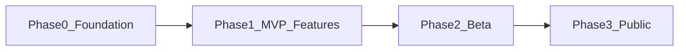

# カップルプラン 開発計画書

## メタ

| 項目 | 内容 |
|------|------|
| 最終更新日 | 2026-05-01 |
| 正本 | 本ファイル（`docs/開発計画書.md`）。進捗は下記表を更新する。 |
| 更新ルール | 原則 **週1回**（金曜想定）に進捗表の状態と集計、変更履歴を更新。 |
| 整合レビュー | 仕様・ADR・実装のズレを防ぐため、**計画本文と [§2.2](#22-本番前に必ず埋めるギャップ一覧) を月1回**は突き合わせる。 |
| 根拠文書 | [カップルプラン_企画書.md](./カップルプラン_企画書.md) |
| プロトタイプ参照 | [../prototype/index.html](../prototype/index.html)（画面遷移・UXの参照。本番の必須仕様を縛らない） |
| 設計意思決定 | [AGENTS.md](../AGENTS.md) に従い、[docs/adr/](./adr/README.md) に ADR を置く。 |

---

## 1. プロダクト合意

### 1.1 1st ローンチのゴール（一文）

[企画書 1章・3章](./カップルプラン_企画書.md) に沿い、**カップル専用のポータル型Webアプリ**として、1st では次の2つを中核体験とする。

- **ミステリールーレット**（週末の予定の「合意」→ 抽選）
- **サイレント・ニンジャ**（秘密の申告 → 週次の集計・公開）

**MVP のゴール**（実装面）: 上記2つが **1組のカップルでE2E完走** でき、**共有しやすい結果**が出る状態（企画書の「500件DB」「100任務」等の規模は後続フェーズで満たす）。

### 1.2 企画書KPI（参照）

企画書セクション8の目標（登録10,000組、WAU 60% 等）は**プロダクト目標**として維持し、**開発計画書では追う指標を分ける**（次節「MVPで計測する指標」）。

---

## 2. MVP 定義（In / Out）

本番化の**最初の船出**は企画書の全機能ではなく、コア体験の**縦通し**を優先する。

| 分類 | 内容 |
|------|------|
| **MVP In** | ユーザー登録（メールOTP）と**既存ユーザーの再ログイン導線**、カップル**ペア成立**（招待コード等の**最小**）、ルーレット用プランの参照・個別スワイプ（いいね/パス）、**マッチ候補の算出**、双方の回答が揃う前提の**候補から抽選**、結果表示・共有しやすいUI；ニンジャ用任務の参照・**申告**、**週次**の集計表示（バッチ/固定時刻の**たたき**で可）；レスポンシブ；PWAの最低限（マニフェスト/オフラインは必要に応じて段階導入） |
| **MVP Out（1st 強化で扱う）** | 企画書の**プラン500件/任務100種**の本格CMS、高度な地域・予算フィルタ、ルーレット履歴の本格管理、カスタムプラン/任務、写真証拠、ご褒美メニュー設定、プッシュ最適化、SNSoneタップ本番品質 等 |
| **2nd（企画書セクション7）** | 記念日、メモリー、家計、メッセージ、ギフトAI等。**MVP WBS では取り扱わない**（ロードマップ節の参照のみ） |

補足:
- **ユーザー登録フロー（新規）**は P1-1 で完了済み。
- **ログインフロー（既存ユーザーの再入）**は P1 の未着手タスクとして扱う（下表 P1-1a）。
- **LP（ランディングページ）**は MVP の必須要件ではなく、Phase 3 の公開/導線整備で扱う（下表 P3-4）。

### 2.1 オンボーディング方針（プロトタイプとの差）

[prototype/index.html](../prototype/index.html) では「表示名・メール → 招待コード」フローがある。本番の一次認証は [ADR 0002](./adr/0002-authentication-email-otp.md) に従い **メールOTP** とする（本番送信は Resend 等。レート制限・`auth_audit` は Phase0 の P0-8 で実装。§2.2 参照）。セッションはサーバー正の `sessions` ＋ `Authorization: Bearer`（[P1-1_会員・ペア連携API仕様.md](./P1-1_会員・ペア連携API仕様.md)）。ソーシャルログイン等は 1st 強化で検討する。MVP では**ペアIDと招待の整合**を最優先する。

### 2.2 本番前に必ず埋めるギャップ一覧

以下は当初WBSの粒度では落ちがちなため、**明示的にチェック**する。完了したらWBS行のメモに反映する。

| 領域 | ギャップ | 主な扱い |
|------|----------|----------|
| 永続化 | **D1 初版スキーマ＋D1 リポジトリ**（[0005](./adr/0005-database-d1.md)）。**ローカル**は従来どおり Node+インメモリ | ルーレット/ニンジャの実データ層を P1 で接続 |
| 認証 | Resend 経由の **本番メール**と **レート/監査**（`auth_audit`、429）。dev は `debugCode` 継続 | [P1-1_会員・ペア連携API仕様.md](./P1-1_会員・ペア連携API仕様.md) の再送等の数値合意（任意） |
| 認証 | **トークン/セッション**方式の確定 | サーバー正のセッションテーブル＋ベアラ。詳細補足は ADR2 |
| 配信 | **CORS**（`ALLOWED_ORIGINS` カンマ区切り）、F/E `VITE_*`、Secrets | Worker / Pages のデプロイは **Cloudflare ダッシュボードの Git 連携**（手順: [P1-1_手動テスト.md](./P1-1_手動テスト.md#cloudflare-staging本番git-連携)） |
| デプロイ | `develop`→ Staging / `main`→ Production の **Git 連携デプロイ**（Workers / Pages） | D1 は環境ごとに `npm run d1:migrate:*` を適用。Workers 側のログ監視を運用へ組み込む |
| CI | `lint` + `api/web` **typecheck** + **`api:smoke` + `web:build`（`ci:pr`）** | 維持 |
| 契約 | OpenAPIと実装の同期、F/E型の**生成または点検** | T9（§4.1）、Phase1 の P1-9（任意） |
| 体験 | ポータル**ホーム**本実装、各機能への**導線** | P1-2 以降と [P1-1_会員・ペア連携API仕様.md](./P1-1_会員・ペア連携API仕様.md) の完了定義 |

---

## 3. 画面・体験フロー対応表（企画書 ↔ プロトタイプ）

企画書 [§4.1・4.2 体験フロー](./カップルプラン_企画書.md) とプロト `section#screen-*` の対応。将来のバックエンド観点は **参照用**（実装方式は未確定）。

| 企画（概要） | プロト `id` / `aria-label` | 本番化で想定するデータ/処理（概念） |
|--------------|------------------------------|--------------------------------------|
| 訪問・案内 | `screen-onboarding-start` 登録開始 | ランディング/オンボの入口 |
| アカウント + カップル紐付け | `screen-onboarding-profile` プロフィール / `screen-onboarding-pair` ペア連携 / `screen-onboarding-done` 登録完了 | ユーザー、カップル、**招待/コード**、ペア `pending` → `active`（要ADR） |
| ポータル（入口） | `screen-home` ホーム | ダッシュボード、各機能へ遷移 |
| ルーレット：プラン提示・判定 | `screen-roulette-swipe` デートプランを選ぶ | プラン候補、**自分のみ**の投票（いいね/パス）保存 |
| ルーレット：マッチ候補 | `screen-roulette-match` マッチしたプラン | 交差集合、候補数しきい値（要ADR/仕様） |
| ルーレット：抽選 | `screen-roulette-spin` ルーレット | 候補から乱択、結果確定、監査用ログ（要ADR） |
| ルーレット：結果・共有 | `screen-roulette-result` 結果 | 結果エンティティ、OGP/画像は1st 強化で可 |
| ニンジャ：任務 | `screen-ninja` ニンジャ任務 | 任務マスタ、申告、**即時相手非通知**（要ADR） |
| ニンジャ：週次発表 | `screen-ninja-result` ニンジャ結果 | 週次集計ジョブ、集計期間、改ざん防止の方針（要ADR） |

---

## 4. マイルストーンとWBS

企画書 [§6 開発ロードマップ（案）](./カップルプラン_企画書.md) を、成果物付きのフェーズに展開する。日付は**未設定**（合意後に本表の「目標週」へ入れる）。

- **Phase 0** — リポジトリ雛形、CI、環境、認証方針、DB スキーマ素案、デプロイ
- **Phase 1** — カップル・ルーレット・ニンジャの **E2E 可能な範囲**まで
- **Phase 2** — クローズドβ（10〜20組想定企画書）、利用規約・PRIVACY、計測・不具合
- **Phase 3** — パブリック、運用、マーケ可能な導線

**Phase 4（企画書）** 以降の拡張は [§7](#7-2nd-ロードマップ企画書セクション7-参照) にのみ記載。MVP からは**依存させない**。

### 4.1 技術選定チェックリスト（TBD 集）

| # | 項目 | 状態 | メモ |
|---|------|------|------|
| T1 | フロント（FW） | 完了 | Vite + TypeScript（[ADR 0004](./adr/0004-vite-hono-architecture.md)） |
| T2 | API（自前 / BaaS） | 完了 | Hono + TypeScript（Cloudflare整合、[ADR 0004](./adr/0004-vite-hono-architecture.md)） |
| T3 | DB | 完了 | Cloudflare D1（[0005](./adr/0005-database-d1.md)）。初版 SQL は `apps/api/migrations/0001_initial.sql` |
| T4 | 認証方針 | 完了 | [0002](./adr/0002-authentication-email-otp.md)（メール OTP）。本番メールは P0-8（Resend 等＋レート/監査） |
| T5 | ホスティング方針 | 完了 | [0001](./adr/0001-deployment-platform-cloudflare.md)（Pages/Workers）。APIの CD ワークフローは P0-9 完了。Web（Pages）・本番URLの確定は別タスク |
| T6 | CI | 完了 | `.github/workflows/ci.yml`（lint＋`ci:pr` 相当の quality job） |
| T7 | 週次ジョブ（ニンジャ） | 未着手 | cron/Queue。ADR5 作成後に具体化 |
| T8 | 通知 | 部分完了 | OTP は Resend（P0-8 実装）。トランザクションメールの運用文面は [P1-1_会員・ペア連携API仕様.md](./P1-1_会員・ペア連携API仕様.md) 参照。Web Push は未 |
| T9 | API契約と型 | 未着手 | `openapi.yaml` とF/E型の生成 or 点検。任意で Phase1 の P1-9 |

### 4.2 P0-1 着手成果（暫定）

`P0-1`（リポジトリ初期化）の最初の成果として、**技術選定前でも破綻しない最小構成**を定義する。

| 項目 | 暫定方針 |
|------|----------|
| 言語方針 | TypeScript（T1/T2 完了。Vite + Hono。ADR 0004） |
| パッケージ方針 | ルート1つで管理し、後でワークスペース化しやすい構成を採用 |
| ディレクトリ方針 | `apps/`（アプリ本体）、`packages/`（共通モジュール）、`infra/`（環境/デプロイ）、`scripts/`（運用補助）、`tests/`（E2E/統合） |
| 既存資産 | `docs/` と `prototype/` は現状維持で正本扱い |

補足: フレームワーク・DB は [§4.1](#41-技術選定チェックリストtbd-集) の T1〜T3・各 ADR に従う。

### 4.3 Phase 1 着手順序の目安（依存関係）

厳密なガントではないが、抜けによる手戻りを減らすための**推奨順**を示す。

1. **P0-7**（DB）を、ルーレット・ニンジャの実データが必要になる前に着手（P1-2 前推奨）。
2. **P0-8** / **P0-9** は並行可能。社外に Staging URL を出すなら P0-9（デプロイ・CORS）を先に。
3. **P0-10**（CI拡充）は、機能開発が重なる前に入れると回 regressions のコストが下がる。
4. **P1-2 〜 P1-5** は ADR3〜5 の作成（または素案）とセットで扱うと設計の二重化を防げる。
5. **P1-8**（E2E）の具体シナリオは、**P1-3**（抽選・結果）まで辿る画面が揃った段階で固める。

---

## 5. 進捗管理

状態: `未着手` / `進行中` / `保留` / `完了`  
集計: 各フェーズ表の**完了行数 / 全行**を週次で更新する。

### Phase 0 — 基盤

| 作業ID | 内容 | 状態 | 目標週 | メモ | 関連ADR |
|--------|------|------|--------|------|---------|
| P0-1 | リポジトリ初期化（言語/パッケージ/ディレクトリ方針） | 完了 |  | 暫定方針定義、雛形ディレクトリ（`apps/` 等）と [README.md](../README.md) で共有済み |  |
| P0-2 | CI 最小（lint または test のガード） | 完了 |  | `npm run lint`（Markdown/HTML）と `.github/workflows/ci.yml` を追加 |  |
| P0-3 | デプロイ先・ステージング方針 | 完了 |  | 案B（Cloudflare）。[ADR 0001](./adr/0001-deployment-platform-cloudflare.md) に記録。デプロイは Cloudflare Connect（[P1-1_手動テスト.md](./P1-1_手動テスト.md#cloudflare-staging本番git-連携)） | [0001](./adr/0001-deployment-platform-cloudflare.md) |
| P0-4 | 認証方式の意思決定 | 完了 |  | MVP認証をメールOTPで確定 | [0002-authentication-email-otp.md](./adr/0002-authentication-email-otp.md) |
| P0-5 | コアER図/エンティティ（User, Couple, Invite 等） | 完了 |  | [データモデル設計メモ](./データモデル設計メモ.md) を作成し、コアERを定義 | [0003-core-entities-couple-invite.md](./adr/0003-core-entities-couple-invite.md) |
| P0-6 | 非機能: 保護方針（PII, HTTPS, 秘密情報） | 完了 |  | [非機能セキュリティ方針](./非機能セキュリティ方針.md) を作成し、MVP基準を明文化 |  |
| P0-7 | DB 採用の確定と初版スキーマ（D1 等）・リポジトリ層の方針 | 完了 |  | [0005](./adr/0005-database-d1.md)、`migrations/0001_initial.sql`、`D1Repository`、Worker エントリ | T3, 0003, 0005 |
| P0-8 | メールOTPの本番配信（プロバイダ選定、再送/レート、監査、devの `debugCode` 扱い） | 完了 |  | Resend HTTP 送信。15分/5 回/メール。`auth_audit`。未設定時は従来どおり `debugCode` | 0002 |
| P0-9 | デプロイの実装（develop→Staging / main→Production）と CORS・Secrets・F/E の環境変数 | 完了 |  | `apps/api/wrangler.toml`、`ALLOWED_ORIGINS`（`*.pages.dev` を含む運用を許容）、**Git 連携**（[P1-1_手動テスト.md](./P1-1_手動テスト.md#cloudflare-staging本番git-連携)）。D1 `database_id` は `wrangler d1 create` の UUID へ | 0001 |
| P0-10 | CI 拡充（`api:typecheck` / `web:typecheck` / `api:smoke` / `web:build` をPRで必須化） | 完了 |  | `pr-gate` ジョブ＋`npm run ci:pr` スクリプト |  |

**完了数 / 全行:** 10 / 10

### Phase 1 — MVP 機能

| 作業ID | 内容 | 状態 | 目標週 | メモ | 関連ADR |
|--------|------|------|--------|------|---------|
| P1-1 | 会員 + カップル作成・招待・ペア成立 API/UI | 完了 |  | APIレイヤ分割 + `apps/web` 本実装 + `api:smoke`/型検査。Cloudflare 上の **メール OTP までのワンパス**手順: [P1-1_手動テスト.md](./P1-1_手動テスト.md#cloudflare-staging本番git-連携) | ADR1,2 |
| P1-1a | ログイン導線（既存ユーザーの再入）UI/API の明確化と手動テスト追加 | 未着手 |  | 新規登録導線とは分離し、既存ユーザーが OTP で再ログインしてホームへ戻れることを完了条件にする | ADR1, T9 |
| P1-2 | ルーレット: プラン参照・本人投票・マッチ候補計算 | 未着手 |  |  | 要 ADR3（§6 参照） |
| P1-3 | ルーレット: 抽選・結果保存 | 未着手 |  |  | ADR3 |
| P1-4 | ニンジャ: 任務・申告 | 未着手 |  |  | 要 ADR4（§6 参照） |
| P1-5 | ニンジャ: 週次集計（手動/バッチのたたき） | 未着手 |  |  | 要 ADR5（§6 参照） |
| P1-6 | PWA: 最低限（マニフェスト/アイコン、方針に沿ったService Worker） | 未着手 |  |  | 要 |
| P1-7 | 結果画面の共有可能性（URL/画像はスコープ要確認） | 未着手 |  |  |  |
| P1-8 | E2E シナリオ1本（例: 登録→ルーレット完走） | 未着手 |  | 本番手動の代替。ツールは Playwright 等TBD。中身はP1-3 以降で定義 |  |
| P1-9 | API契約と型の運用（`openapi.yaml` 同期、F/E型の生成または定期点検） | 未着手 |  | 品質投資。必須度は都度見直し | T9 |

**完了数 / 全行:** 1 / 10

### Phase 2 — クローズドβ

| 作業ID | 内容 | 状態 | 目標週 | メモ | 関連ADR |
|--------|------|------|--------|------|---------|
| P2-1 | β招待・フィードバック導線 | 未着手 |  |  |  |
| P2-2 | 利用規約・プライバシーポリシー | 未着手 |  |  |  |
| P2-3 | 計測（MVP 指標 §6.1）のイベント設計 | 未着手 |  |  |  |
| P2-4 | 障害/負荷の一次対応 | 未着手 |  |  |  |

**完了数 / 全行:** 0 / 4

### Phase 3 — パブリック

| 作業ID | 内容 | 状態 | 目標週 | メモ | 関連ADR |
|--------|------|------|--------|------|---------|
| P3-1 | 本番リリース・ドメイン | 未着手 |  |  |  |
| P3-2 | 監視・アラート | 未着手 |  |  |  |
| P3-3 | 企画書マーケ（§5）実行可能な範囲のチェック | 未着手 |  |  |  |
| P3-4 | LP（ランディングページ）公開導線の実装（遷移・計測含む） | 未着手 |  | MVP本体と分離して実装。最低限、登録導線への到達計測を含める |  |

**完了数 / 全行:** 0 / 4

---

## 6. ADR 候補（意思決定が必要なトピック）

[AGENTS.md](../AGENTS.md) に従い、**実装前**に重要テーマを ADR 化する。番号付き ADR ファイルは**意思決定時に** `docs/adr/NNNN-title.md` として追加する。置き場所とテンプレは [docs/adr/README.md](./adr/README.md)。

| ID | 仮タイトル | 概要 | 状況 |
|----|------------|------|------|
| ADR1 | 認証 | メール/ソーシャル/マジックリンク等、セッション | 作成済み（[0002-authentication-email-otp.md](./adr/0002-authentication-email-otp.md)） |
| ADR2 | カップルと招待 | コード形式、`pending`/`active`、解除 | 作成済み（[0003-core-entities-couple-invite.md](./adr/0003-core-entities-couple-invite.md)） |
| ADR3 | ミステリールーレット状態 | 非同期、候補交差、抽選乱数、再挑戦 | 未作成 |
| ADR4 | ニンジャ申告 | 相手非通知、改ざん、写真の扱い（MVP外可） | 未作成 |
| ADR5 | 週次集計 | 集計窓、タイムゾーン、冪等ジョブ | 未作成 |

上表 `関連ADR` 列の「要」は、該当 ADR **作成後**にファイル名へ差し替える。

---

## 6.1 MVP で計測する指標（企画書セクション8のサブセット）

企画書の**リリース3ヶ月目標**（10,000組等）は、マーケ・成長段階で追う。開発と直結しやすい **MVP/β 向け**に次を定義する（ツール名はTBD）。

| 指標 | 定義（案） | 利用 |
|------|------------|------|
| 登録完走率 | オンボーディング開始 → ペア**active** まで完了した割合 | ペア導線の改善 |
| 週当たり起動 | 1組あたり週のセッション数 | 価値実感の粗い代理 |
| ルーレット完走率 | 投票開始 → 結果画面まで到達 | 体験の完走性 |
| ルーレット所要時間 | 投票開始完了までの中央値（目標5分は企画書4.1） |  |
| ニンジャ申告数/週/組 | 申告件数 | 企画書4.2 KPI の先行指標 |
| 結果スクリーン表示回数 | ルーレット/ニンジャ結果 | 共有・バズ用の素地 |

**リリース後**は企画書8の**登録数・シェア数・掲載**を本格追跡する。

---

## 7. 2nd ロードマップ（企画書セクション7 参照）

- 記念日、メモリー、家計、メッセージ、ギフトAI 等
- 本MVP から**依存を持たない**。優先度は別途プロダクトバックログで整理。

---

## 8. リスクと対策（初期）

| リスク | 影響 | 対策の方向（要詳細化） |
|--------|------|------------------------|
| ペア解消・乗っ取り | プライバシー・紛争 | 招待の再確認、解除フロー、データ削除方針（ADR/ポリシー） |
| ニンジャの虚偽申告 | 体験破壊 | MVP は自己申告前提の説明、β後に制約やリアクション検討 |
| 週次ジョブ失敗 | 信頼低下 | 冪等、再実行、手動補正、ユーザー通知（ADR5） |
| 同時制約（ルーレット） | 不整合 | サーバー正と状態遷移（ADR3） |
| OTPメールの未到達 | 登録導線の離脱 | 再送制限の設計、受信トラブル向け案内、プロバイダの選定（P0-8） |
| Workers/D1/無料枠の制約 | 想定外の制限 | 早めの負荷とクエリの試算、P0-7/9 完了後に本番近い検証 |
| 計画と実装の乖離 | 優先度誤解 | 週次の進捗表更新、§2.2 との照合、ADR 先出し（AGENTS.md） |

---

## 9. 変更履歴

| 日付 | 内容 |
|------|------|
| 2026-04-25 | 初版。開発計画書骨子、MVP、画面対応表、WBS/進捗表、ADR候補、MVP指標、リスク。 |
| 2026-04-25 | P0-1 着手。暫定の言語/パッケージ/ディレクトリ方針を追記し、P0-1 を `進行中` に更新。 |
| 2026-04-25 | P0-1 更新。雛形ディレクトリ（`apps/` 等）とリポジトリ初期化メモ文書を追加。 |
| 2026-04-25 | P0-1 完了。`README.md` 追加と完了条件の明文化により、P0-1 を `完了` に更新。 |
| 2026-04-25 | P0-2 完了。`npm` 初期化、`markdownlint-cli`/`htmlhint`、`lint` scripts、`.github/workflows/ci.yml` を追加。 |
| 2026-04-25 | P0-3 着手。デプロイ・ステージング方針案文書を追加（後に ADR 0001 へ集約。2026-04-26 に文書廃止）。候補比較・運用ルール案・未決事項を整理。 |
| 2026-04-25 | P0-3 完了。案B（Cloudflare）採用を確定し、[ADR 0001](./adr/0001-deployment-platform-cloudflare.md) を追加。 |
| 2026-04-25 | 運用方針更新。デプロイ環境を `Staging / Production` の2環境に変更（方針書とADR 0001を同期）。 |
| 2026-04-25 | 運用トリガー更新。`develop` マージで Staging、`main` マージで Production に変更。 |
| 2026-04-25 | P0-4 完了。認証方式をメールOTPで確定し、[ADR 0002](./adr/0002-authentication-email-otp.md) を追加。 |
| 2026-04-25 | P0-5 完了。コアER/エンティティを定義した [データモデル設計メモ](./データモデル設計メモ.md) と [ADR 0003](./adr/0003-core-entities-couple-invite.md) を追加。 |
| 2026-04-25 | P0-6 完了。[非機能セキュリティ方針](./非機能セキュリティ方針.md) を追加し、PII/HTTPS/SecretsのMVP基準を確定。 |
| 2026-04-25 | P1-1 着手。会員・ペア連携のAPI契約を [openapi.yaml](../apps/api/openapi.yaml) と [P1-1仕様メモ](./P1-1_会員・ペア連携API仕様.md) として追加。 |
| 2026-04-25 | P1-1 更新。ローカルモックAPIをTypeScript化（[server.ts](../apps/api/src/server.ts)）し、`api:typecheck` を追加。 |
| 2026-04-25 | 運用修正。`prototype/index.html` は要件定義用途に戻し、API検証は `apps/api` 側で実施する方針に統一。 |
| 2026-04-25 | P1-1 完了。`api:smoke` を追加し、会員登録〜招待受諾のスモークテストを自動化。 |
| 2026-04-25 | 判定修正。P1-1の完了条件を再定義し、状態を `進行中` に戻した（UI本実装・アーキテクチャ整備が未了）。 |
| 2026-04-25 | P1-1 完了（再更新）。APIをレイヤ分割し、`apps/web` に会員・招待・受諾UI本実装を追加。 |
| 2026-04-25 | 技術方針確定。F/EをVite、B/EをHonoに統一し、[ADR 0004](./adr/0004-vite-hono-architecture.md) を追加。 |
| 2026-04-25 | 計画見直し。§2.1の認証「未決」表記をADR0002に整合。§2.2（ギャップ一覧）、TBD表の実態（T4〜T6、T8〜T9）、Phase0のP0-7〜P0-10、Phase1のP1-9、§4.3、リスク3件、付録を追記。 |
| 2026-04-26 | Phase0 完了。ADR 0005、D1 マイグレーション、`D1Repository`、Resend/レート/監査、`wrangler`+デプロイ CD、CI `ci:pr` ゲート。§2.2・T3/T6/T8・P0-7〜P0-10 を更新。 |
| 2026-04-26 | ドキュメント整理。重複の大きかった `リポジトリ初期化メモ` / `デプロイ・ステージング方針案` を削除（内容は `README`・ADR 0001・本書に集約）。データモデル・P1-1 仕様・手動テスト・非機能を現状に合わせて更新。 |
| 2026-04-26 | Cloudflare 完走用: `deploy-api.yml` 廃止（Git 連携前提）、`d1:migrate:*` スクリプト、`api:smoke` の `API_BASE_URL` 対応、`.dev.vars` / `web/.env` 例、P1-1_手動テストに Cloudflare 節。 |
| 2026-04-30 | 本番障害対応を反映。CORS の許可判定を強化（`*.pages.dev` を許容可能に更新）し、運用時の `ALLOWED_ORIGINS` 前提を明確化。 |
| 2026-04-30 | 本番D1で `0001_initial.sql` 未適用により `/auth/otp/request` が 500 となる事象を解消（`npm run d1:migrate:production` 適用）。デプロイ欄の説明を現運用（Git連携＋必要時手動 migrate）に同期。 |
| 2026-05-01 | スコープ明確化。新規登録（完了）とログイン（未着手）を分離し、Phase1 に `P1-1a` を追加。LP は MVP 外として Phase3 に `P3-4` を追加。 |

**記入例（週次）:** 2026-04-25 — Phase0: P0-1 を `進行中` に。完了数/全行を更新。

---

## 付録

- [カップルプラン_企画書.md](./カップルプラン_企画書.md)
- [prototype/index.html](../prototype/index.html)
- [AGENTS.md](../AGENTS.md)
- [docs/adr/README.md](./adr/README.md)（作成済み ADR の索引）
- [データモデル設計メモ.md](./データモデル設計メモ.md)
- [`.github/workflows/ci.yml`](../.github/workflows/ci.yml)（`lint` + quality ゲート）
- Cloudflare: Worker / Pages の Git 接続手順 [P1-1_手動テスト.md](./P1-1_手動テスト.md#cloudflare-staging本番git-連携)
- [非機能セキュリティ方針.md](./非機能セキュリティ方針.md)
- [adr/0004-vite-hono-architecture.md](./adr/0004-vite-hono-architecture.md)
- [../apps/api/openapi.yaml](../apps/api/openapi.yaml)（P1-1 以降の API 契約の正本）
- [P1-1_会員・ペア連携API仕様.md](./P1-1_会員・ペア連携API仕様.md)
- [P1-1_手動テスト.md](./P1-1_手動テスト.md)
